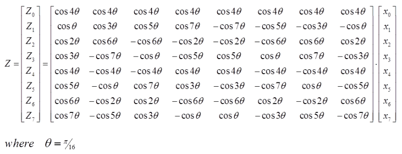
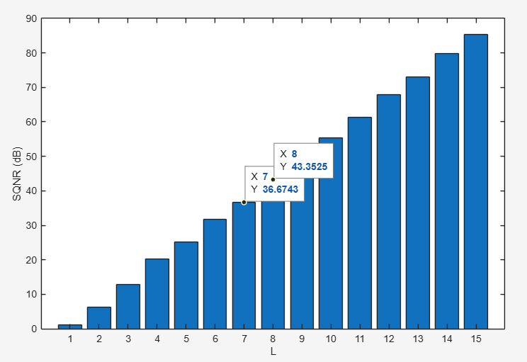
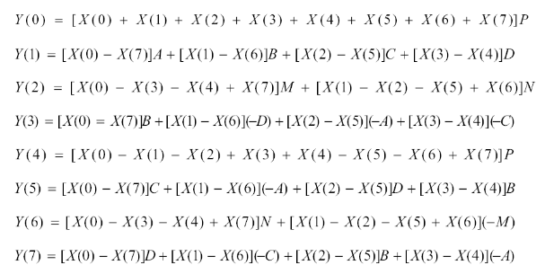
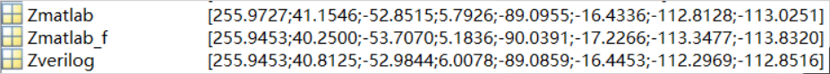
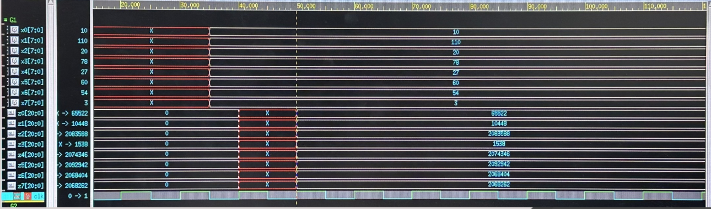

# 1D 8-point DCT Design

## Table of Contents
- [Overview](#overview)
- [Implement Status](#implement-status)
- [File Description](#file-description)
- [Specification](#specification)
- [Method & Results](#method--results)
- [RTL Waveform](#rtl-waveform)

&nbsp;

## Overview

This project implements a 1D (One-Dimensional) 8-point Discrete Cosine Transform (DCT) using Verilog HDL. The 1D DCT is a fundamental signal processing operation that transforms time-domain or spatial-domain signals into the frequency domain.
The 1D DCT performs transformation on a sequence of N points, converting the input signal into frequency domain coefficients. It is widely used in audio compression, speech processing, and as a building block for 2D DCT in image compression.
This project can be summarized in the following points:
1. **Algorithm Optimization**: Exploits DCT matrix symmetry to reduce multiplications by 50%
2. **Fixed-Point Design**: Achieves SQNR ≥ 40 dB with 8-bit coefficients
3. **Hardware Efficiency**: Minimizes multiplier count for lower area and power
4. **Verified Correctness**: Verilog output matches MATLAB reference with high accuracy

### Mathematical Expression
The following figure shows the architecture of expanding the DCT formula using a matrix.

<div align="center">
  
  <p><i>Figure: 1D 8-point DCT matrix representation</i></p>
</div>

The matrix equation is:
```
Z = C × X
```

Where:
- `X = [x₀, x₁, x₂, x₃, x₄, x₅, x₆, x₇]ᵀ` is the input vector
- `C` is the 8×8 DCT coefficient matrix
- `Z = [z₀, z₁, z₂, z₃, z₄, z₅, z₆, z₇]ᵀ` is the output (DCT coefficients)
- `θ = π/16`


### Design Approach

The implementation leverages the **symmetric and anti-symmetric properties** of the DCT coefficient matrix to reorganize computations:

| Approach | Multiplications | Description |
|----------|----------------|-------------|
| **Traditional Matrix Multiplication** | 64 (8×8) | Direct matrix-vector multiplication |
| **Optimized Approach** | 32 | Exploits coefficient symmetry |
| **Reduction** | **50%** | Hardware efficiency improvement |

By factoring out common coefficients and pre-computing differences like `[X(0) - X(7)]`, the design significantly reduces hardware multiplier count.


&nbsp;

## Implement Status

Synthesis completed.

&nbsp;


## File Description

| File Name | Description |
|-----------|-------------|
| `1D_DCT.v` | Main RTL module implementing the 1D DCT architecture |
| `TM.v` | Testbench for 1D_DCT module verification |
| `bits_calculate.m` | MATLAB script for coefficient bit-width calculation, SQNR analysis, and fixed-point quantization |
| `coeff_conversion.m` | MATLAB script for converting floating-point coefficients to 8-bit binary representation |

&nbsp;


## Specification

### Input Ports

| Port Name | Width | Description |
|-----------|-------|-------------|
| `clk` | 1-bit | System clock signal - synchronizes all DCT operations |
| `rst` | 1-bit | Reset signal - initializes the DCT module (active low) |
| `x0~x7` | 8-bit | Input sample - signed 8-bit value |

### Output Ports

| Port Name | Width | Description |
|-----------|-------|-------------|
| `z0~z7` | 21-bit | DCT coefficient - DC component (signed) |

&nbsp;

## Method & Results

The design methodology consists of four main steps: coefficient bit-width calculation, coefficient conversion, algorithm optimization, and Verilog implementation.

### ◆ Step 1: Coefficient Bit-Width Calculation

**Objective**: Determine the minimum bit width required to achieve SQNR ≥ 40 dB.

<div align="center">
  
  <p><i>Figure: SQNR analysis for different coefficient bit widths</i></p>
</div>

#### Process:
1. Generate random test input
2. Compute floating-point reference: `Z = C × X`
3. For each bit width L (from 1 to 15):
   - Quantize coefficients: `C_f = floor(C × 2^L) / 2^L`
   - Compute quantized output: `Z_f = C_f × X`
   - Calculate error: `Error = Z - Z_f`
   - Compute SQNR: `SQNR(L) = 10 × log₁₀(signal / noise)`
4. Plot SQNR vs. bit width

**Result**: 
- **8-bit** (7-bit + 1 sign bit) achieves **SQNR ≈ 43.7 dB**
- Meets the target specification of SQNR ≥ 40 dB
- Provides good balance between precision and hardware cost

---

### ◆ Step 2: Coefficient Conversion to Binary

Convert floating-point DCT coefficients to 8-bit fixed-point binary representation.

**Output** (8-bit binary coefficients):
```
11111011  (c1)
11101100  (c2)
11010100  (c3)
10110101  (c4)
10001110  (c5)
01100001  (c6)
00110001  (c7)
```

**Note**: MATLAB's `dec2bin` uses one's complement representation, which may introduce minor quantization differences in verification.

---

### ◆ Step 3: Algorithm Optimization

**Key Insight**: The DCT coefficient matrix exhibits **symmetric and anti-symmetric properties**, allowing us to reorganize the computation to reduce multiplications.

<div align="center">
  
  <p><i>Figure: Reorganized DCT equations exploiting symmetry</i></p>
</div>

#### Coefficient Mapping

Referring to the DCT matrix shown in the [Overview](#overview) section:

| Symbol | DCT Coefficient | Mathematical Expression |
|--------|-----------------|------------------------|
| A | c1 | cos(θ) = cos(π/16) |
| B | c3 | cos(3θ) = cos(3π/16) |
| C | c5 | cos(5θ) = cos(5π/16) |
| D | c7 | cos(7θ) = cos(7π/16) |
| M | c2 | cos(2θ) = cos(2π/16) |
| N | c6 | cos(6θ) = cos(6π/16) |
| P | c4 | cos(4θ) = cos(4π/16) = 1/√2 |

*where θ = π/16*

#### Computational Savings:

| Method | Multiplications | Advantage |
|--------|----------------|-----------|
| **Direct Matrix** | 8 × 8 = 64 | Straightforward |
| **Optimized** | 4~8 per output, ~32 total | **50% reduction** |


---

### ◆ Step 4: Verilog RTL Implementation

The Verilog implementation directly maps the optimized equations into hardware.

---

### ◆ Step 5: Verification
The verification compares three computation methods to validate the Verilog implementation:

1. **MATLAB Floating-Point Results**: Ideal computation using original coefficients
2. **MATLAB Fixed-Point Results**: Computation using 8-bit quantized coefficients  
3. **Verilog Simulation Output**: Hardware result (divided by 2<sup>8</sup>, since coefficients are multiplied by 2<sup>8</sup> during fixed-point operations)
<div align="center">
  
</div>

&nbsp;

## RTL Waveform
<div align="center">
  
</div>
