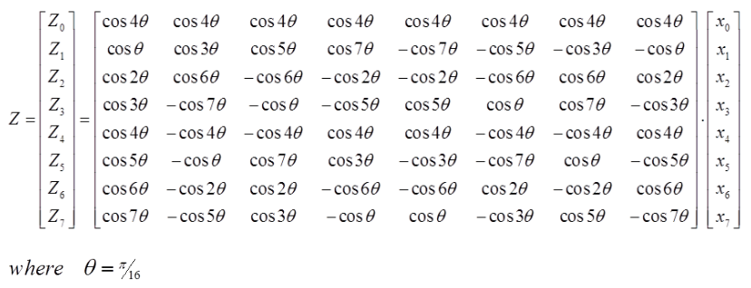
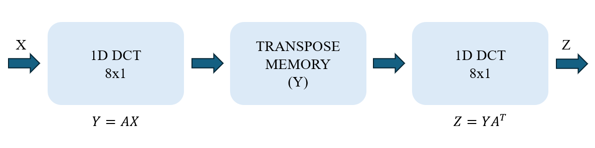
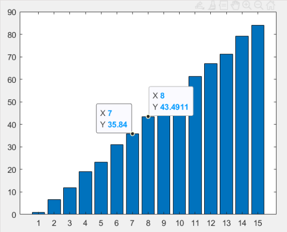
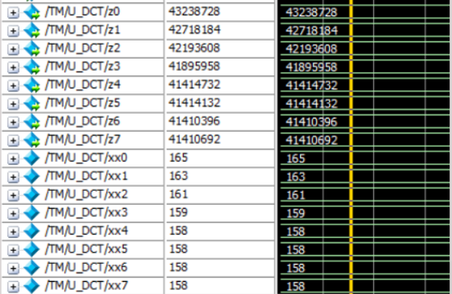

# 2D 8-point DA-based DCT Design (not edited yet)

## Table of Contents
- [Overview](#overview)
- [Implement Status](#implement-status)
- [File Description](#file-description)
- [Specification](#specification)
- [Method & Results](#method--results)
- [RTL Waveform & Comparison with MATLAB](#rtl-waveform--comparison-with-matlab)
- [Synthesis Results](#synthesis-results)

&nbsp;

## Overview

This project implements a 2D 8-point Discrete Cosine Transform (DCT) using Verilog HDL. The 2D DCT is a fundamental mathematical method used in signal processing and image compression, commonly applied in JPEG and MPEG standards.
The 2D Discrete Cosine Transform converts spatial domain image data into frequency domain representation. It decomposes the original signal or image into a weighted sum of cosine functions, where high-frequency components can be quantized to achieve compression.
This project can be summarized in the following points:
1. **Distributed Architecture (DA)**: Effectively reduces multiplication operations and hardware complexity
2. **Coefficient Transpose Method**: Enables 2D DCT through two 1D operations
3. **Fixed-Point Optimization**: Balances precision (SQNR ≥ 40 dB) with hardware efficiency
4. **Synthesis Optimization**: Explores timing-area-power trade-offs through multiple constraints and compile strategies


### Mathematical Expression & Design Flow

The 2D DCT is computed through two sequential 1D DCT operations, the following figure is the architecture of 1D DCT:

<div align="center">
  
</div>

And the figure below is the flow chart of the design:

<div align="center">
  
</div>

### Key Features

- **Distributed Architecture (DA)**: Reduces multiplication operations by replacing them with additions, saving hardware resources and enabling efficient pipeline processing
- **Matrix Transpose Method**: Implements 2D DCT using two 1D DCT operations with coefficient matrix transposition
- **Fixed-Point Arithmetic**: Uses 8-bit (7-bit + 1 sign bit) coefficient representation
- **8×8 Block Processing**: Standard size for JPEG compression

&nbsp;

## Implement Status

Synthesis completed.

&nbsp;

## File Description

| File Name | Description |
|-----------|-------------|
| `2D_DCT.v` | Main RTL module implementing the 2D 8-point DCT |
| `coeff_conversion.m` | MATLAB script for converting floating-point coefficients to binary |
| `coeff_binary.txt` | List of 8-bit binary coefficients (c1~c7) |

&nbsp;

## Specification

### Input Ports

| Port Name | Width | Description |
|-----------|-------|-------------|
| `clk` | 1-bit | System clock signal - synchronizes all DCT operations |
| `rst` | 1-bit | Reset signal - initializes the DCT module |
| `x0~x7` | 8-bit | Input data - 8×8 block of pixel values |

### Output Ports

| Port Name | Width | Description |
|-----------|-------|-------------|
| `z0~z7` | 34-bit | DCT coefficients - 8×8 frequency domain output |

### DCT Coefficients

The seven cosine coefficients used in the design:
```
θ = π/16

c1 = cos(θ)
c2 = cos(2θ)
c3 = cos(3θ)
c4 = cos(4θ)
c5 = cos(5θ)
c6 = cos(6θ)
c7 = cos(7θ)
```

Binary representation (8-bit):
```
c1: 11111011
c2: 11101100
c3: 11010100
c4: 10110101
c5: 10001110
c6: 01100001
c7: 00110001
```

&nbsp;

## Method & Results

The design methodology consists of three main parts: coefficient bit-width calculation, Verilog architecture design, and implementation.

### ◆ Step 1: Coefficient Bit-Width Calculation

**Objective**: Determine the minimum bit width required to achieve SQNR ≥ 40 dB.

<div align="center">
  
  <p><i>Figure: SQNR vs. Coefficient Bit-Width</i></p>
</div>

#### Process:
1. Generate test data with floating-point DCT coefficients
2. Quantize coefficients to different bit widths (4-bit to 12-bit)
3. Compute SQNR: `SQNR(dB) = 10 × log₁₀(signal_power / quantization_noise_power)`
4. Plot SQNR results as bar chart

**Result**: 8-bit representation (7-bit + 1 sign bit) achieves SQNR ≥ 40 dB

#### Coefficient Conversion to Binary

Convert floating-point coefficients to 8-bit fixed-point binary

**Note**: Using MATLAB's `dec2bin` function with one's complement conversion may introduce minor errors in verification.

---

### ◆ Step 2: Verilog Architecture

Two implementation approaches for 2D DCT:

1. **Coefficient Transpose Method** (Selected Approach):
   - Perform 1st 1D DCT operation
   - Transpose coefficient matrix and store in registers
   - Perform 2nd 1D DCT with transposed coefficients

2. **Input Transpose Method**:
   - Perform 1st 1D DCT operation
   - Transpose output data through dedicated architecture
   - Use control signals to select inputs for 2nd DCT

---

### ◆ Step 3: Distributed Architecture (DA) Implementation

#### First 1D DCT Operation (DA-based):

The DA architecture reduces multiplication count by pre-computing and reusing partial products:
```
y0 = [x0+x1+x2+x3+x4+x5+x6+x7] × c4
y1 = [x0-x7]×c1 + [x1-x6]×c3 + [x2-x5]×c5 + [x3-x4]×c7
y2 = [x0-x3-x4+x7]×c2 + [x1-x2-x5+x6]×c6
y3 = [x0-x7]×c3 + [x1-x6]×(-c7) + [x2-x5]×(-c1) + [x3-x4]×(-c5)
y4 = [x0-x1-x2+x3+x4-x5-x6+x7] × c4
y5 = [x0-x7]×c5 + [x1-x6]×(-c1) + [x2-x5]×c7 + [x3-x4]×c3
y6 = [x0-x3-x4+x7]×c6 + [x1-x2-x5+x6]×(-c2)
y7 = [x0-x7]×c7 + [x1-x6]×(-c5) + [x2-x5]×c3 + [x3-x4]×(-c1)
```

#### Second 1D DCT Operation (Matrix Multiplication with Transposed Coefficients):
```
z0 = [y0+y4]×c4 + y1×c1 + y2×c2 + y3×c3 + y5×c5 + y6×c6 + y7×c7
z1 = [y0-y4]×c4 + y1×c3 + y2×c6 - y3×c7 - y5×c1 - y6×c2 - y7×c5
z2 = [y0-y4]×c4 + y1×c5 - y2×c6 - y3×c1 + y5×c7 + y6×c2 + y7×c3
z3 = [y0+y4]×c4 + [y2+y6]×(-c6) + y1×c7 - y3×c5 + y5×c3 - y7×c1
z4 = [y0+y4]×c4 - y1×c7 - y2×c2 + y3×c5 - y5×c3 - y6×c6 + y7×c1
z5 = [y0-y4]×c4 - y1×c5 - y2×c6 + y3×c1 - y5×c7 + y6×c2 - y7×c3
z6 = [y0-y4]×c4 - y1×c3 + y2×c6 + y3×c7 + y5×c1 - y6×c2 + y7×c5
z7 = [y0+y4]×c4 - y1×c1 + y2×c2 - y3×c3 - y5×c5 + y6×c6 - y7×c7
```

---

### ◆ Step 4: Verilog RTL Design

The complete Verilog implementation includes:

1. **Input Stage**: Registers for storing 8×8 input block
2. **1st DCT Module**: DA-based 1D DCT computation
3. **Transpose & Storage**: Register bank for intermediate results
4. **2nd DCT Module**: Matrix multiplication with transposed coefficients
5. **Output Stage**: Final 8×8 DCT coefficient output


&nbsp;

## RTL Waveform & Comparison with MATLAB

<div align="center">
  
  <p><i>Figure: MATLAB floating-point vs. fixed-point comparison</i></p>
</div>


&nbsp;

## Synthesis Results

### Timing Analysis

**Observation**: As timing constraint decreases, both area and power consumption increase significantly.

---

### Compile Ultra Optimization

**Analysis**: 
- Single `compile_ultra` improves timing, area, and power but still fails timing
- Double `compile_ultra` achieves better timing but with significantly increased power (>2×)
- Trade-off between timing, area, and power must be carefully considered


